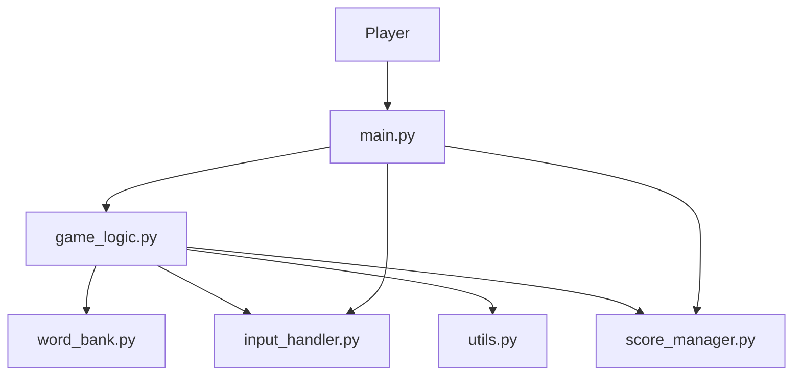
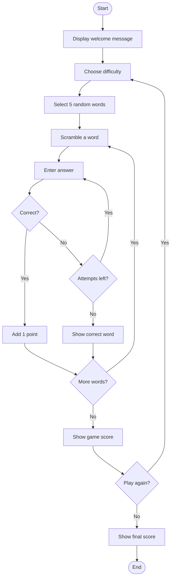
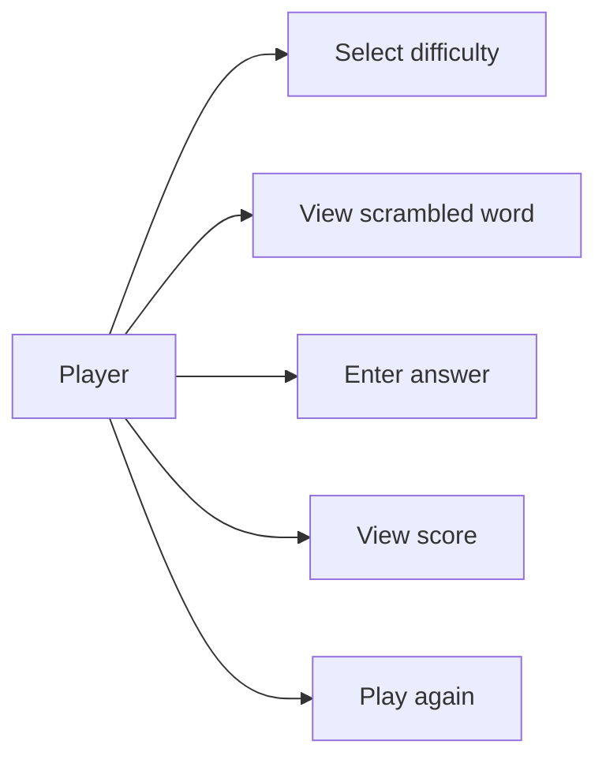
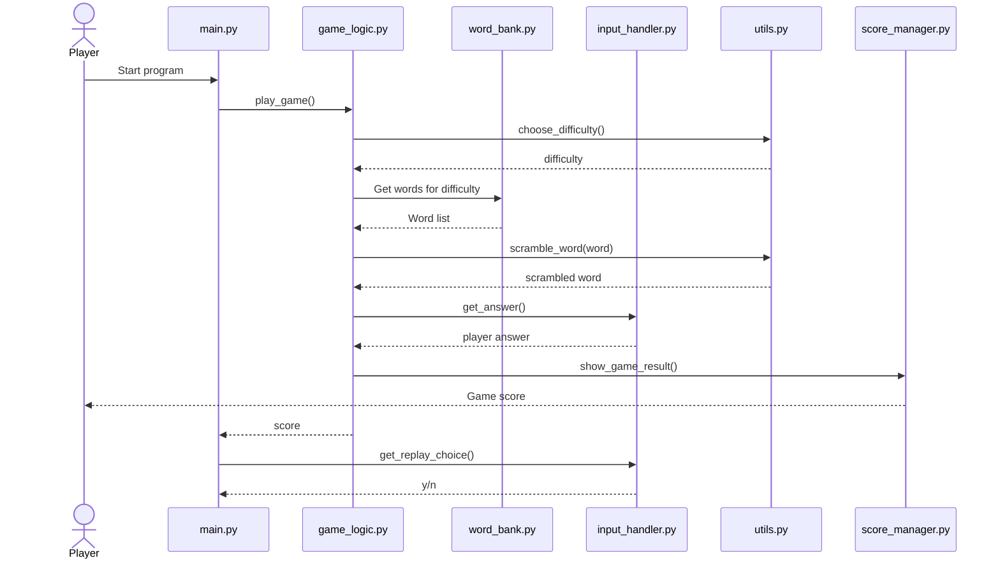
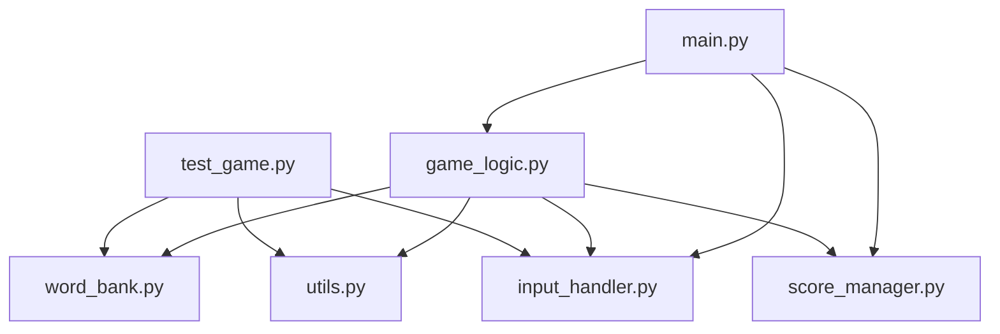

# Design Diagrams

These diagrams describe the current Word Scramble Challenge program.

## 1. System Architecture

## 2. Workflow Diagram

## 3. Use Case Diagram

## 4. Sequence Diagram

## 5. Component/File Relationship

## Storage Design

A database is **not applicable** to this project. The words are stored in Python lists inside `word_bank.py`, so no ER diagram or database schema is required.
